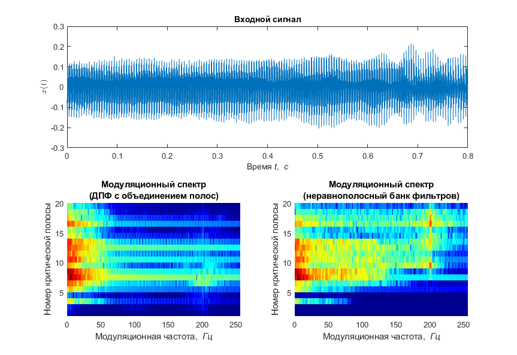

# Анализ модуляционного спектра голоса в критических полосах звуковых частот (Analysis of Modulation spectra of audio signal in critical bands)

### Аннотация
В репозитории представлены matlab-реализации двух схем анализа модуляционного спектра голосового сигнала в критических полосах звуковых частот. Приведены два подхода к оценке спектра сигнала в психоакустической шкале барков (1 барк = 1 критической полосе):

1) на основе вычисления ДПФ-спектра с последующим объединением спектральных коэффициентов;

2) на основе пропускания сигнала через неравнополосный ДПФ-модулированный банк фильтров;

Особенностью первого способа является его простота и вычислительная эффективность в силу существования быстрых алгоритмов вычисления ДПФ. Отличием второго способа является возможность анализа сигнала с различным временным разрешением в зависимости от анализируемой полосы частот. В этом отношении анализ сигнала с использованием ДПФ менее гибкий, поскольку имеет фиксированное окно анализа для всех частотных полос.

### Схема анализа модуляционного спектра на основе ДПФ с последующим объединением каналов 


### Схема анализа модуляционного спектра на основе неравнополосного банка фильтров


### Реализация

В скрипте ```main.m``` приведен пример анализа сигнала при помощи указанных схем.

```
[x,fs] = audioread('p020.wav');   % анализируемый сигнал

[MS_in_CB, cfg] = MS_fft_analysis(x, fs);   % схема на основе ДПФ
[MSw_in_CB, ~]  = MS_wdftfb_analysis(x, fs);% схема на основе банка фильтров
```
Ниже приведен пример получающегося модуляционного спектра для голосового сигнала.



